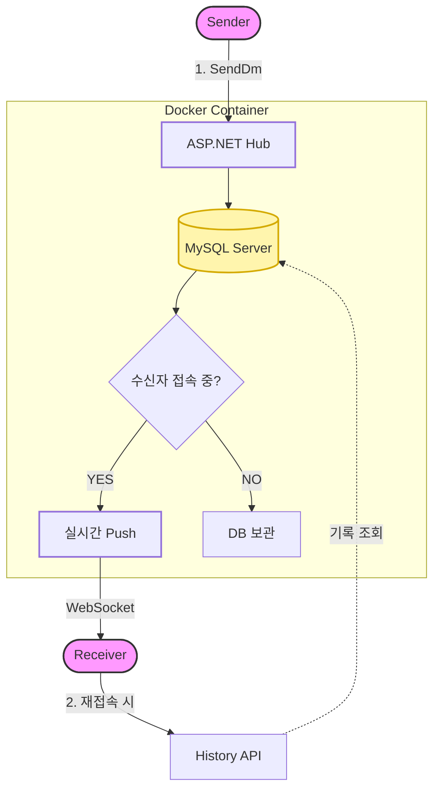
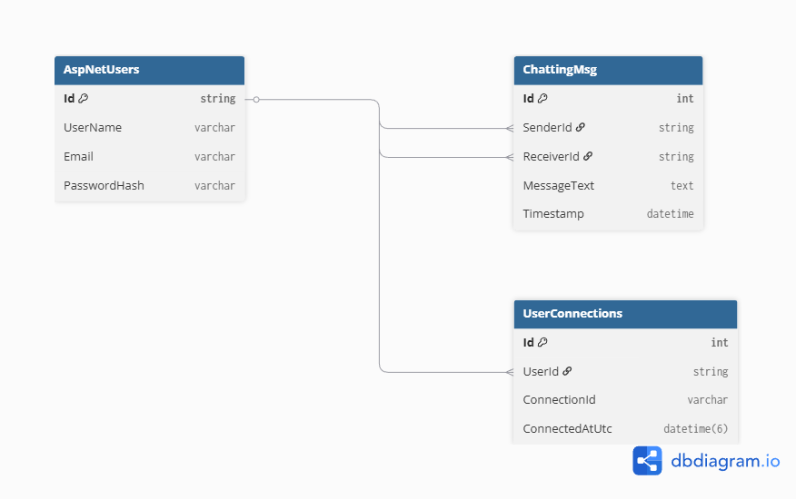
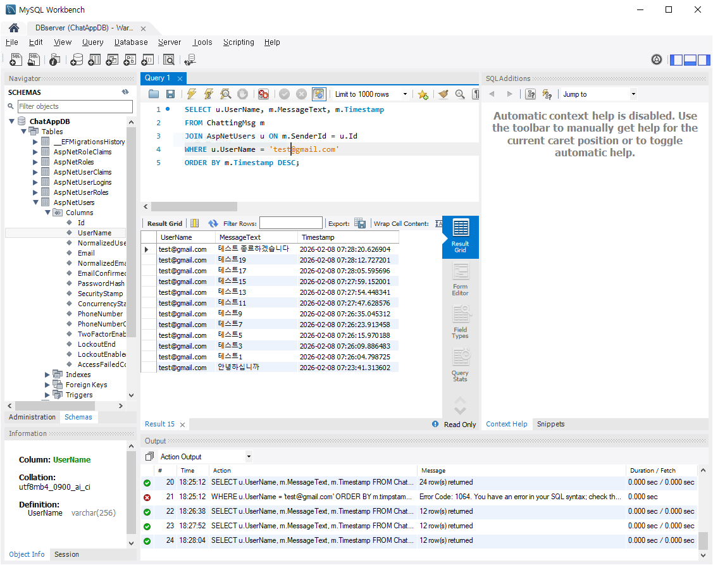

# ASP.NET ChatApp 
**(PHP/JS Polling → ASP.NET Core/WebSocket)**

기존 **PHP + JavaScript(폴링)** 기반 1:1 채팅을 **ASP.NET Core + WebSocket** 으로 이식한 프로젝트입니다.  
레거시의 “주기적 조회” 방식 대신, 서버가 클라이언트에 **즉시 Push** 하는 실시간 구조로 변경했습니다. 

최신 업데이트로  **SQLite에서 MySQL 환경**으로 시스템 아키텍처를 고도화하였습니다.

현재 **웹소켓 기반 실시간 통신과 기본 흐름**을 구축한 상태이며, **서비스 고도화를 위한 기능을 확장 중**에 있습니다."

---

## 1) Polling → WebSocket으로 바꾼 이유

### Polling(주기적 조회)의 한계
- **불필요한 트래픽 증가**: 새 메시지가 없어도 일정 주기로 계속 요청 발생
- **지연**: “다음 폴링 주기”까지 메시지 표시가 늦어짐
- **서버 부하/확장성 문제**: 동시 접속자 증가 시 반복 요청이 누적되어 비용/부하 상승
- **상태 동기화 난이도**: 온라인 표시, 실시간 이벤트(입장/퇴장) 처리에 비효율

### WebSocket(SignalR) 전환 효과
- **실시간 Push**: 메시지/상태 변경을 서버가 즉시 전송
- **트래픽/부하 감소**: 이벤트가 있을 때만 통신
- **온라인 상태 연동이 자연스러움**: 온라인/오프라인 처리 용이
- **1:1 DM 구조에 적합**: SignalR Group을 이용해 채널 단위로 송수신

---
## 주요 기능 및 화면

### 1) 인증 및 계정 관리

|          회원가입          |          로그인          |
| :------------------------: | :----------------------: |
|  |  |

- **ASP.NET Core Identity** 기반의 보안 인증 및 세션 관리
- 사용자 유효성 검증 및 프로필 설정

---

### 2) 실시간 채팅 시스템 

|      실시간 유저 목록      |          1:1 채팅          |
| :------------------------: | :------------------------: |
|  |  |

- **상태 동기화**: SignalR 연결(OnConnected) 이벤트를 감지하여 **접속 여부(Online/Offline) 즉시 반영**
- **양방향 통신**: 주기적 요청(Polling) 없이, 서버가 클라이언트에게 메시지를 **직접 Push**하여 지연 시간 최소화
- **그룹핑(Grouping)**: `ConnectionId` 관리를 통해 특정 유저 간의 **프라이빗 1:1 채널** 생성  

---

## 주요 기능

- **실시간 1:1 DM**: SignalR + Group 기반 메시지 송수신
- **메시지 영속화 + 히스토리 + 오프라인 전달**
- **로그인/회원가입**: ASP.NET Identity 기반 인증
- **유저 목록/검색**: 유저 페이지에서 사용자 리스트 조회 및 탐색
- **온라인/오프라인 표시**: SignalR 연결/해제 시점을 기반으로 상태 반영
- **프로필 이미지 업로드/삭제**
  - 이미지 업로드 시 서버 저장 
  - 삭제 시 기본 이미지로 복귀

---
### 실시간 채팅 메세지 플로우

다음은 **사용자 A**가 **사용자 B**에게 메시지를 보낼 때의 내부 처리 과정입니다.


---

 ### 데이터베이스 설계

---

대용량 트래픽 처리를 고려한 정규화된 데이터 모델링을 수행했습니다.

* **ER Diagram**: `dbdiagram.io`를 활용하여 테이블 간 관계를 정의
    * `AspNetUsers`와 `ChattingMsg` 간의 1:N 관계를 통한 메시지 히스토리 관리

> 

---

### 데이터 무결성과 쿼리 검증

---

MySQL Workbench를 통해 복잡한 쿼리를 검증하고 데이터 무결성을 테스트했습니다.

* **쿼리 검증**: 단순 조회가 아닌 `JOIN`과 `WHERE` 절을 활용하여 조회.

* **테스트 시나리오**: 특정 유저의 메시지 발신 이력을 시간순으로 정렬하여 조회하는 쿼리 실행.

  

```sql
-- 예시: 유저 닉네임과 채팅 내용을 함께 조회하는 JOIN 쿼리
SELECT u.UserName, m.MessageText, m.Timestamp
FROM ChattingMsg m
JOIN AspNetUsers u ON m.SenderId = u.Id
WHERE u.UserName = 'test@gmail.com'
ORDER BY m.Timestamp DESC;
```

---

## 레거시 대비 변경사항(요약)

### 레거시(PHP/JS Polling)
- 클라이언트가 **주기적으로** 서버에 요청하여 새 메시지 조회
- 새 메시지가 없어도 요청이 반복됨(트래픽/부하 증가)
- 온라인 상태/실시간 이벤트 처리에 비효율

### 이식 후(ASP.NET Core + SignalR)
- 서버가 메시지를 **즉시 Push** (실시간)

- SignalR 연결 이벤트 기반으로 **온라인/오프라인** 반영

- 1:1 DM을 **Group(룸) 단위**로 관리하여 송수신 구조 단순화

  

---

## 프로젝트 로드맵 

- **데이터베이스 인덱싱**: 대량의 채팅 데이터 조회 성능을 높이기 위한 인덱스 설계.
- **서버 사이드 유효성 검증**: 메시지 길이 제한과 같은 서버 기준의 데이터 방어 로직 추가.
- **Rate Limiting**: 특정 사용자의 과도한 요청이나 스팸 채팅을 방지하기 위한 전송 제한 기능.

- **이미지 저장 구조 개선**: DB 부하 방지를 위해 바이너리 데이터와 메타데이터(경로) 분리 저장.

---

## 기술 스택 

### **언어 및 프레임워크  ** 

- **C# / .NET 8.0**:  C#과 .NET 프레임워크의 기능을 활용한 서버 개발.  

### **백엔드 및 실시간 통신 ** 

- **ASP.NET Core Web API**:  사용자 인증 및 채팅 히스토리 조회를 위한 REST API 구축.  
- **SignalR (WebSocket)**:  실시간 양방향 통신 구현 및 1:1 대화방(Group) 관리.  

### **데이터 관리 

- **Entity Framework Core**: 객체 지향적 데이터베이스 스키마 설계 및 관리.  
- **MySQL 8.0**: RDBMS를 통한 데이터 영속성 확보 및 관계형 데이터 모델링 수행.  

---

### **개발 도구 

- **Visual Studio 2022**: 주 개발 환경으로 사용하며 생산적인 디버깅 및 프로젝트 관리 수행.  
- **MySQL Workbench**: SQL 쿼리 성능 테스트 및 데이터 정합성 검증.  
- **Git / GitHub**: 

---

## **실행 방법**

이 프로젝트는 별도의 설정 없이 명령어 한 줄로 서버와 DB를 즉시 가동할 수 있습니다.  

**1) 필수 조건**

-  docker 설치 및 실행  

**2) 프로젝트 실행**  

- 터미널에서 docker-compose up --build 입력  

**3) 접속 정보**  

- **Web Client:** `http://localhost:5000`  

- **MySQL DB:** `localhost:3306`   

  (ID: `root` / PW: `df456258`)

---
