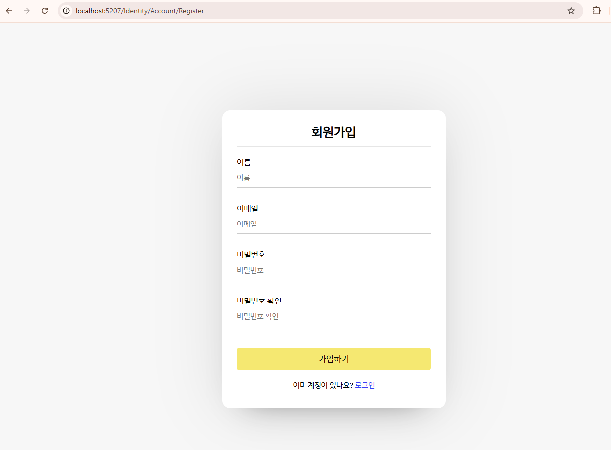
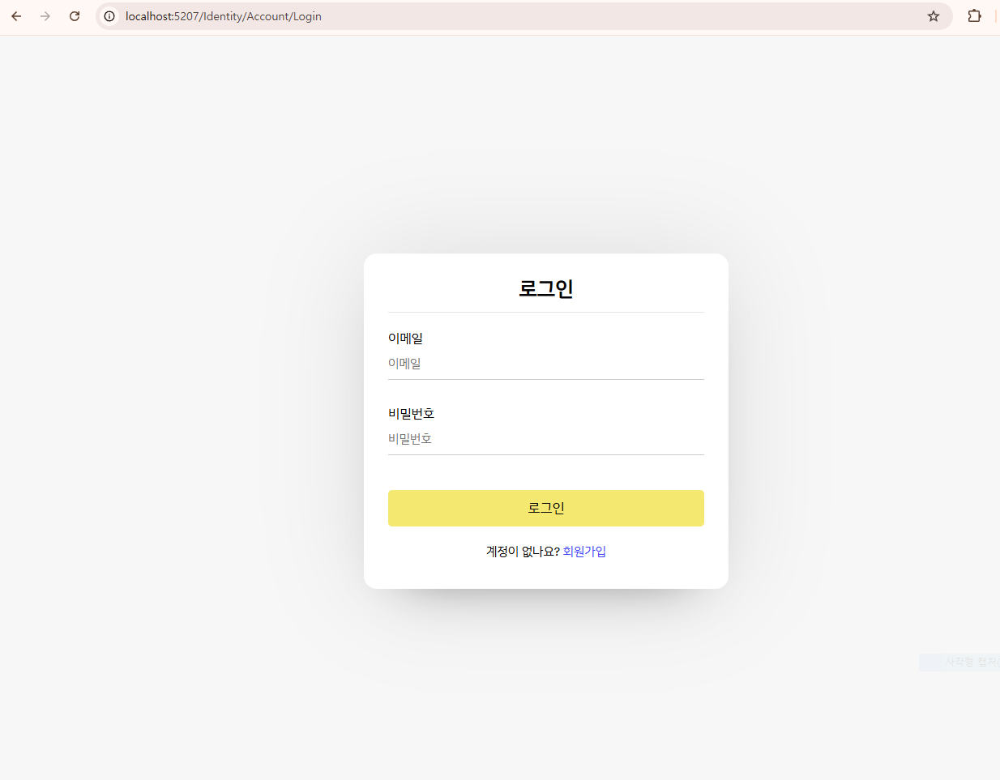
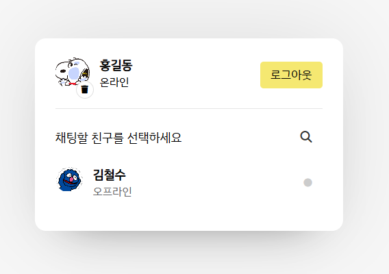
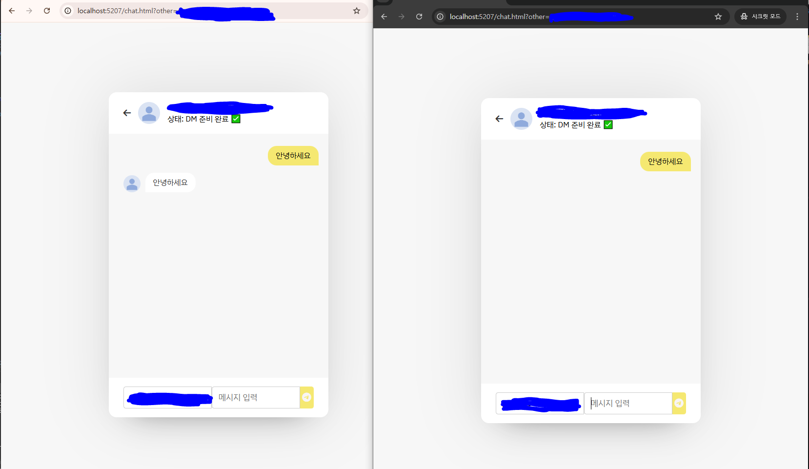

# ASP.NET ChatApp 
**(PHP/JS Polling → ASP.NET Core/WebSocket)**

기존 **PHP + JavaScript(AJAX 폴링)** 기반 1:1 채팅을 **ASP.NET Core + WebSocket** 으로 이식한 프로젝트입니다.  
레거시의 “주기적 조회” 방식 대신, 서버가 클라이언트에 **즉시 Push** 하는 실시간 구조로 변경했습니다. 

최신 업데이트로  **SQLite에서 Docker 기반의 MySQL 환경**으로 시스템 아키텍처를 고도화하였습니다.

현재 **웹소켓 기반 실시간 통신과 기본 흐름**을 구축한 상태이며, **서비스 고도화를 위한 기능을 확장 중**에 있습니다."

---

## 1) Polling → WebSocket으로 바꾼 이유

### Polling(주기적 조회)의 한계
- **불필요한 트래픽 증가**: 새 메시지가 없어도 일정 주기로 계속 요청 발생
- **지연**: “다음 폴링 주기”까지 메시지 표시가 늦어짐
- **서버 부하/확장성 문제**: 동시 접속자 증가 시 반복 요청이 누적되어 비용/부하 상승
- **상태 동기화 난이도**: 온라인 표시, 실시간 이벤트(입장/퇴장) 처리에 비효율

### WebSocket(SignalR) 전환 효과
- **실시간 Push**: 메시지/상태 변경을 서버가 즉시 전송
- **트래픽/부하 감소**: 이벤트가 있을 때만 통신
- **온라인 상태 연동이 자연스러움**: 온라인/오프라인 처리 용이
- **1:1 DM 구조에 적합**: SignalR Group을 이용해 채널 단위로 송수신

---
## 주요 기능 및 화면 (Key Features)

### 인증 및 계정 관리

|          회원가입          |          로그인          |
| :------------------------: | :----------------------: |
|  |  |

- **ASP.NET Core Identity** 기반의 보안 인증 및 세션 관리
- 사용자 유효성 검증 및 프로필 설정

---

### 실시간 채팅 시스템 (WebSocket/SignalR)

| 실시간 유저 목록 (Live Status) | 1:1 채팅 (Direct Message)  |
| :----------------------------: | :------------------------: |
|      |  |

- **상태 동기화**: SignalR 연결(OnConnected) 이벤트를 감지하여 **접속 여부(Online/Offline) 즉시 반영**
- **양방향 통신**: 주기적 요청(Polling) 없이, 서버가 클라이언트에게 메시지를 **직접 Push**하여 지연 시간 최소화
- **그룹핑(Grouping)**: `ConnectionId` 관리를 통해 특정 유저 간의 **프라이빗 1:1 채널** 생성

## 2) 주요 기능

- **실시간 1:1 DM**: SignalR Hub + Group(대화방) 기반 메시지 송수신
- **메시지 영속화 + 히스토리 + 오프라인 전달**
- **로그인/회원가입**: ASP.NET Identity 기반 인증
- **유저 목록/검색**: 유저 페이지에서 사용자 리스트 조회 및 탐색
- **온라인/오프라인 표시**: SignalR 연결/해제 시점을 기반으로 상태 반영
- **프로필 이미지 업로드/삭제**
  - 이미지 업로드 시 서버 저장 
  - 삭제 시 기본 이미지로 복귀

---
### 실시간 채팅 메세지 플로우
다음은 **사용자 A**가 **사용자 B**에게 메시지를 보낼 때의 내부 처리 과정입니다.

---

## 레거시 대비 변경사항(요약)

### 레거시(PHP/JS Polling)
- 클라이언트가 **주기적으로** 서버에 요청하여 새 메시지 조회
- 새 메시지가 없어도 요청이 반복됨(트래픽/부하 증가)
- 온라인 상태/실시간 이벤트 처리에 비효율

### 이식 후(ASP.NET Core + SignalR)
- 서버가 메시지를 **즉시 Push** (실시간)
- SignalR 연결 이벤트 기반으로 **온라인/오프라인** 반영
- 1:1 DM을 **Group(룸) 단위**로 관리하여 송수신 구조 단순화

---
## 추가 예정

### RDBMS 전환 (SQL Server)
- **SignalR 분산 환경 구축** (Redis)
  
- 데이터 **샤딩** 설계

###  서버 방어 추가: Rate limit + 서버 검증

- **전송 제한(스팸 방지)**
  - 유저별 초당 N회 제한 + 메시지 길이 제한을 **서버에서 강제**
  
- **입력 검증 최소 세트**
  - 메시지/닉네임 길이 제한, 공백/유효성 체크 등 서버 기준으로 방어

---
